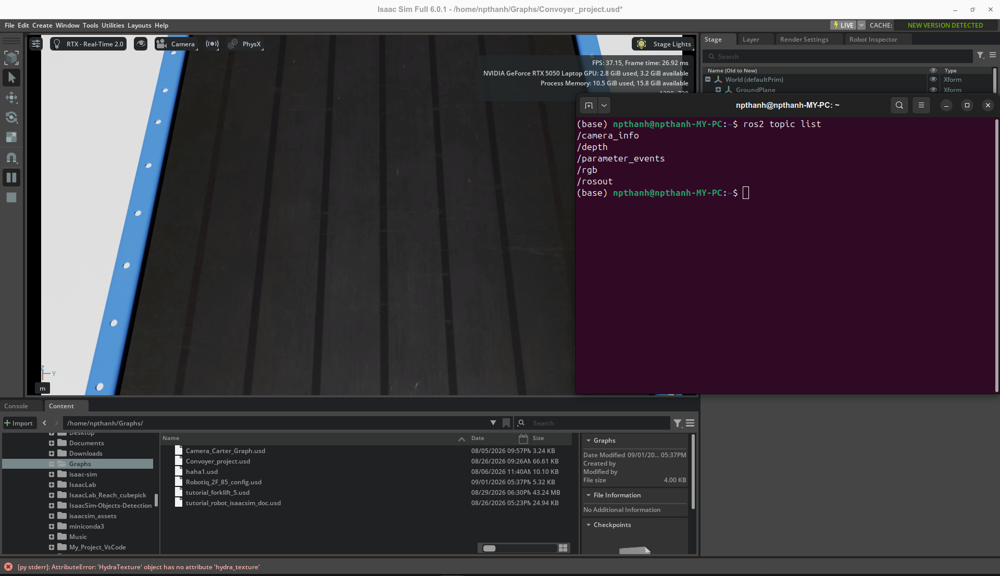
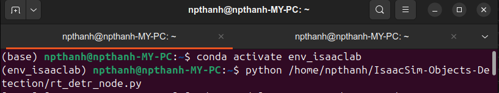
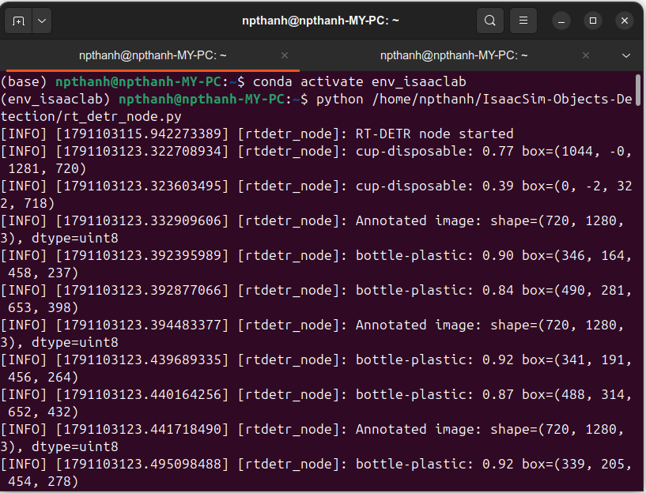
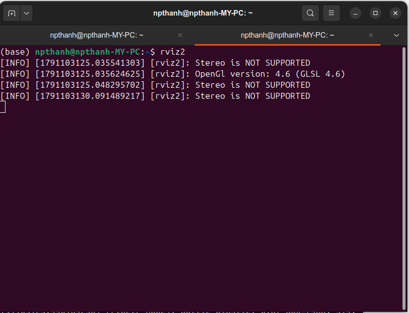

# 🤖 IsaacSim Objects Detection

Real-time object detection inside **NVIDIA Isaac Sim** using **RT-DETR** (Real-Time DEtection TRansformer) and **ROS 2**.

> [!NOTE]
> Tested on **Isaac Sim 6.0.1**. Compatibility with older versions is not guaranteed.

---

## 📋 Table of Contents

- [Overview](#overview)
- [System Architecture](#system-architecture)
- [Requirements](#requirements)
- [Installation](#installation)
- [Project Structure](#project-structure)
- [Usage](#usage)
- [ROS 2 Topics](#ros-2-topics)
- [Output](#output)
- [Demo](#demo)
- [Technical Notes](#technical-notes)

---

## 🔍 Overview

This project implements a **ROS 2 Node** (`rtdetr_node`) that performs real-time object detection on the RGB camera stream published by NVIDIA Isaac Sim. The node subscribes to incoming frames, runs inference using an RT-DETR model, annotates bounding boxes on the image, and re-publishes the result for downstream visualization or processing.

### ✨ Features

- 📷 **Subscribe** to RGB frames from Isaac Sim via `/rgb`
- 🧠 **Run RT-DETR inference** using a fine-tuned (`best.pt`) or pretrained (`rtdetr-l.pt`) model
- 🖼️ **Annotate bounding boxes** with class labels and confidence scores
- 📡 **Publish annotated frames** to `/detection/image`
- 📝 **Log detections** — class name, confidence, and bounding box coordinates

---

## 🏗️ System Architecture

```
┌─────────────────────┐        /rgb         ┌──────────────────────┐
│                     │ ──────────────────► │                      │
│   NVIDIA Isaac Sim  │   sensor_msgs/Image │   RTDETRNode (ROS2)  │
│   (RGB Camera)      │                     │   rt_detr_node.py    │
│                     │                     │                      │
└─────────────────────┘                     └──────────┬───────────┘
                                                        │
                                             /detection/image
                                                        │
                                                        ▼
                                            ┌───────────────────────┐
                                            │  Annotated Image      │
                                            │  (Bounding Boxes      │
                                            │   + Labels)           │
                                            └───────────────────────┘
```

**Processing pipeline:**

```
ROS Image msg
     │
     ▼
CvBridge (imgmsg_to_cv2)
     │
     ▼
RT-DETR Inference (Ultralytics)
     │
     ▼
Bounding Box Parsing (class, confidence, coords)
     │
     ▼
result.plot() → Annotated Frame
     │
     ▼
Manual Image() msg construction
     │
     ▼
Publisher → /detection/image
```

---

## ⚙️ Requirements

### Software

| Component | Version |
|---|---|
| **NVIDIA Isaac Sim** | 6.0.1 *(tested)* |
| **ROS 2** | Humble / Iron / Jazzy |
| **Python** | 3.8+ |
| **Ultralytics** | ≥ 8.0 |
| **OpenCV** | ≥ 4.5 |
| **cv_bridge** | ROS 2 compatible |

> [!WARNING]
> Only **Isaac Sim 6.0.1** has been verified. Earlier releases may have different ROS 2 bridge behavior or camera topic names.

### Python dependencies

```bash
pip install ultralytics opencv-python
```

### ROS 2 dependencies

```bash
sudo apt install ros-$ROS_DISTRO-cv-bridge \
                 ros-$ROS_DISTRO-sensor-msgs
```

---

## 🚀 Installation

### 1. Clone the repository

```bash
git clone https://github.com/NPThanhh/IsaacSim-Objects-Detection.git
cd IsaacSim-Objects-Detection
```

### 2. Install Python dependencies

```bash
pip install ultralytics
```

### 3. Prepare models

Place model files in the `models/` directory:

```
models/
├── best.pt        # Fine-tuned RT-DETR model (currently used)
└── rtdetr-l.pt    # Original pretrained RT-DETR-L model
```

> [!NOTE]
> To switch models, update the path inside `rt_detr_node.py` at the `RTDETR(...)` constructor call.

### 4. Source ROS 2

```bash
source /opt/ros/$ROS_DISTRO/setup.bash
```

---

## 📁 Project Structure

```
IsaacSim-Objects-Detection/
├── models/
│   ├── best.pt           # Fine-tuned RT-DETR model (~66 MB)
│   └── rtdetr-l.pt       # Pretrained RT-DETR-L model (~66 MB)
├── rt_detr_node.py       # Main ROS 2 node
└── README.md
```

---

## ▶️ Usage

### Step 1: Launch Isaac Sim

Open **NVIDIA Isaac Sim 6.0.1** and set up a simulation environment with an RGB camera. Make sure the camera is publishing images to the `/rgb` topic via the ROS 2 bridge.

### Step 2: Run the detection node

```bash
# Source ROS 2
source /opt/ros/$ROS_DISTRO/setup.bash

# Run the node
python3 rt_detr_node.py
```

If integrated into a ROS 2 package:

```bash
ros2 run <your_package> rtdetr_node
```

### Step 3: Visualize results

```bash
# Open RViz2 and subscribe to /detection/image
rviz2

# Or inspect the topic directly
ros2 topic info /detection/image
ros2 topic hz /detection/image
```

---

## 📡 ROS 2 Topics

| Topic | Type | Direction | Description |
|---|---|---|---|
| `/rgb` | `sensor_msgs/Image` | Subscribe | RGB frames from Isaac Sim camera |
| `/detection/image` | `sensor_msgs/Image` | Publish | Annotated frames with bounding boxes |

### Image format

- **Encoding:** `bgr8`
- **Source:** Isaac Sim RGB camera

---

## 📊 Output

The node logs each detection in the following format:

```
[rtdetr_node]: <class_name>: <confidence> box=(<x1>, <y1>, <x2>, <y2>)
```

**Example:**

```
[rtdetr_node]: person: 0.95 box=(120, 80, 340, 450)
[rtdetr_node]: box: 0.87 box=(500, 200, 680, 380)
[rtdetr_node]: Annotated image: shape=(720, 1280, 3), dtype=uint8
```

---

## 🎬 Demo

### Screenshots






### Demo Video


---

## 📝 Technical Notes

- The node **manually constructs** the `sensor_msgs/Image` message instead of using `cv2_to_imgmsg()` to avoid encoding compatibility issues with `bgr8`.
- `best.pt` is a fine-tuned version of `rtdetr-l.pt` trained on a custom Isaac Sim dataset.
- `verbose=False` suppresses unnecessary Ultralytics console output during inference.

---

## 📄 License

This project is open and free for everyone to use, modify, and distribute. No restrictions.
